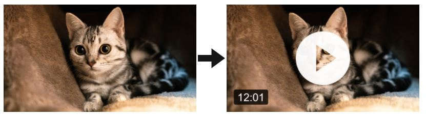
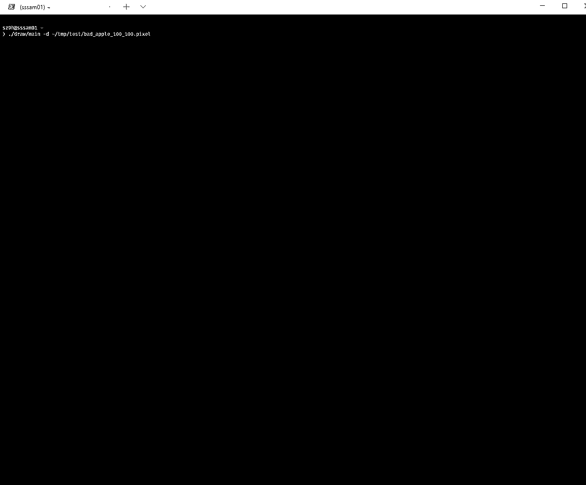

# Play - not really sure what this repo is about...

## Add a play button

Add a play button and text to an image. Try it [here](http://207.148.93.73/#play-button).



## Repeat pattern design

Design a repeat pattern. Try it [here](http://207.148.93.73/#repeat-pattern).


## Chat

A simple chat app. Try it [here](http://207.148.93.73/#chat).


## Pixel

Play video in terminal! [video](https://youtu.be/k53wc5ggOYI) [视频](https://www.bilibili.com/video/BV1eK4y1L7HK/)



```bash
# Step 0: Use ffmpeg or other tools to generate images
ffmpeg -i ../video/bad_apple.mp4 -vf fps=24 -vsync 0 %d.png

# Step 1: Compile executable
go build cmd/pixel/pixel.go

# Step 2: Encode images to binary
# -o: output file path
# -f: frame rate
# -w, -h: width, height
# images files, separated by space
./pixel -o ../test/out.pixel -f 24 -w 100 -h 100 $(ls *.png | sort -n)

# Step 3: Decode
./pixel -d ../tmp/test/out.pixel
```
